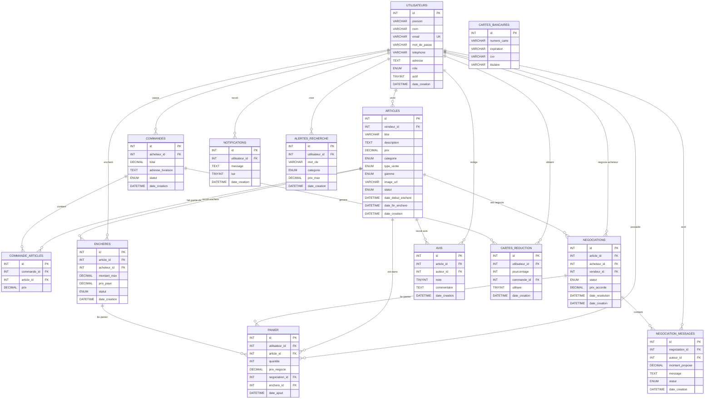

# Modele Entite-Association - Omnes MarketPlace

## Diagramme Mermaid

Coller UNIQUEMENT le contenu entre les balises ```mermaid sur https://mermaid.live



## Legende des ENUM

- **UTILISATEURS.role** : acheteur, vendeur, administrateur
- **ARTICLES.categorie** : Electronique, Vetements, Maison, Livres, Sports, Divers
- **ARTICLES.type_vente** : achat_immediat, negociation, meilleure_offre
- **ARTICLES.gamme** : regulier, haut_de_gamme, rare
- **ARTICLES.statut** : disponible, vendu, retire
- **ENCHERES.statut** : en_attente, gagnant, perdant
- **COMMANDES.statut** : en_attente, confirmee, expediee, livree, annulee
- **NEGOCIATIONS.statut** : en_cours, accepte, refuse, expire
- **NEGOCIATION_MESSAGES.statut** : en_attente, accepte, refuse
- **AVIS.note** : CHECK 1 a 5

## Contraintes notables

- **PANIER** : UNIQUE (utilisateur_id, article_id)
- **ENCHERES** : UNIQUE (article_id, acheteur_id)
- **AVIS** : UNIQUE (article_id, auteur_id)
- **PANIER.negociation_id** : FK vers NEGOCIATIONS, ON DELETE SET NULL
- **PANIER.enchere_id** : FK vers ENCHERES, ON DELETE SET NULL
- Toutes les FK principales : ON DELETE CASCADE
