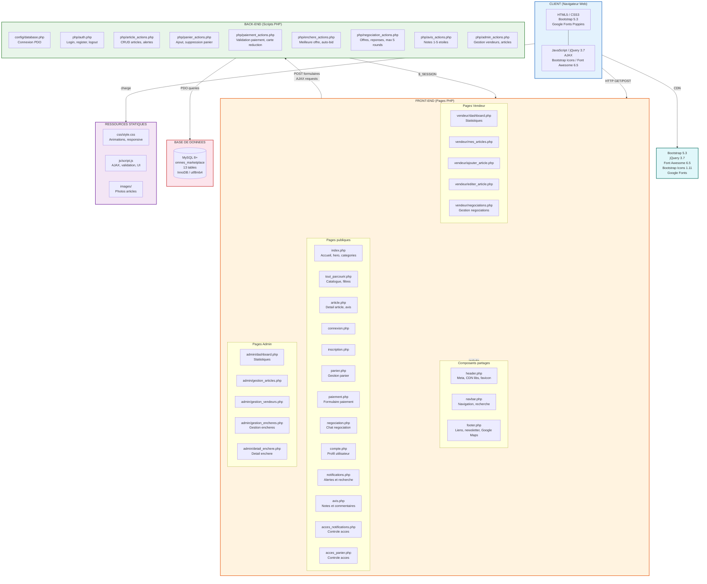
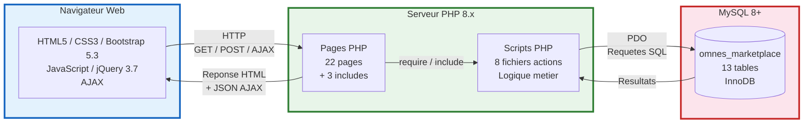
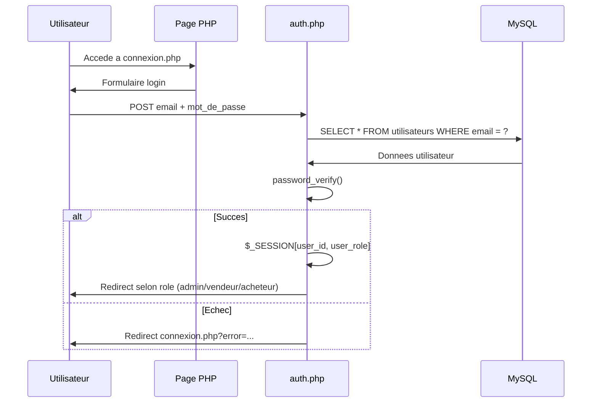
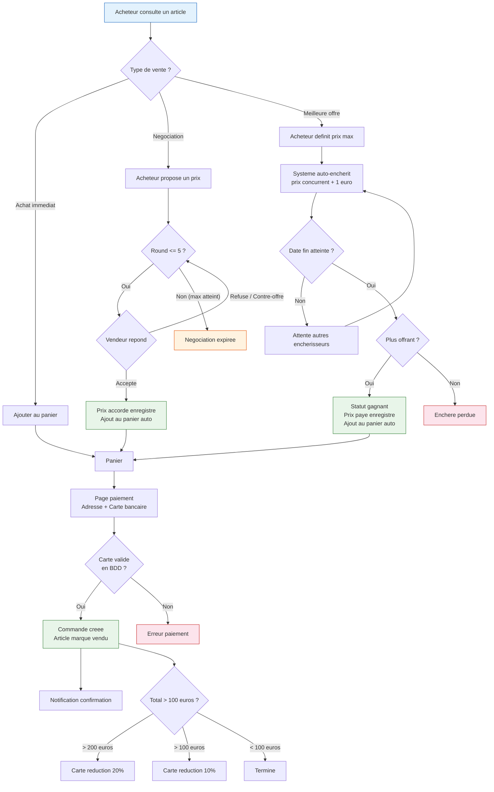

# Architecture du Systeme - Omnes MarketPlace

## Diagramme Mermaid (coller sur https://mermaid.live pour generer l'image)

## Diagramme simplifie (version 1 page)

## Flux d'authentification

## Flux d'achat (3 modes)

